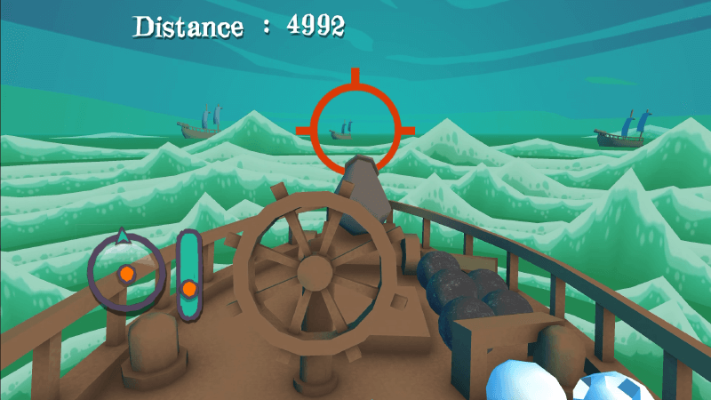
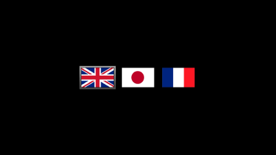
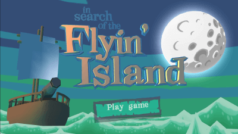
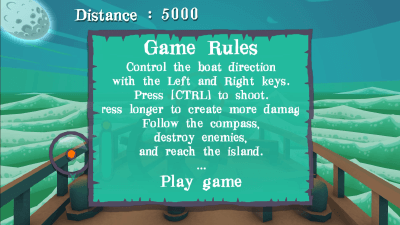
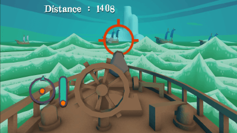

# (in search of the) Flyin'Island

_A game prototype made for the TigSource ["Cockpit Compo"](https://www.tigsource.com/2009/02/20/cockpit-compo/) in 2009_

 

 

 

In 2009, the **TigSource** community organized a 1-month competition called **"Cockpit Compo"**, whose topic was to make a game in subjective view from inside the vehicle/ship/vessel…

This theme was inspired by 90’s video games such as the Midwinter series (Atari ST, Amiga) where the outside environment was seen through the mask of a polar suit or the windshield of a jetski. You can find this graphic principle even today, in more recent games, like MKD during the shooting stages. This specific layout created a feeling of confinement and was perfetcly suited to 4×3 monitors or TVs.

## The game

I deciced to transport the player onto the deck of a 17th century ship. Unlike the cockpit games of the late 80s, the vehicle is fully rendered in 3D whereas the surrounding scenery is rendered using a fake 2.5D effect, inspired by a theater stage. The ship thus remains in the center of a wave animation, moving in concentric circles whose oscillatory rotation gives the illusion of the swell.

The game is built on top of the [GameStart engine](https://www.youtube.com/@GameStart3D/videos) and entirely implemented in [Squirrel](https://github.com/albertodemichelis/squirrel).

- :tiger: [The original devlog thread](https://forums.tigsource.com/index.php?topic=5130.80) on the TigSource forum
- :vhs: [A Video capture](https://www.youtube.com/watch?v=BxLvjwyroVo) of the gameplay

## Credits

- [Astrofra]() (code, design & 3D)
- [Emmanuel Julien](https://github.com/ejulien/) (engine and tech. support)
- [Benoît Charcosset](https://www.pouet.net/topic.php?which=12360)† aka "maf464" (music)
- [Masami Tanzi](https://vocaloid.fandom.com/wiki/Captain_Mirai) aka "Captain Mirai" (Japanese Translation)
